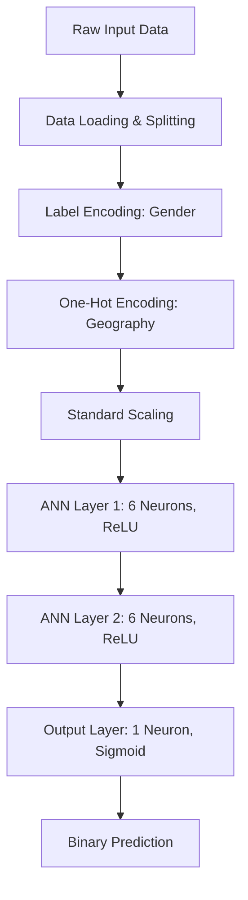

# 🏦 ANN Customer Churn Prediction

[](https://www.python.org/downloads/)
[](https://www.tensorflow.org/)
[](https://scikit-learn.org/)

A professional-grade implementation of an **Artificial Neural Network (ANN)** to predict customer churn in a banking environment. This project transition's from an experimental Jupyter Notebook to a production-ready, modular Python package.

---

## 🚀 Key Features

- **Modular Architecture**: Separate modules for data ingestion, feature engineering, and modeling.
- **Automated Pipeline**: End-to-end execution from raw CSV to model evaluation.
- **Advanced Preprocessing**: Comprehensive handling of categorical data (Label & One-Hot Encoding) and feature scaling.
- **Neural Network Modeling**: Optimized ANN using `TensorFlow` and `Keras`.
- **Performance Evaluation**: Detailed metrics including Confusion Matrix and Accuracy scores.

---

## 🏗 Project Structure

```text
├── data/
│   ├── raw/                  # Immutable original dataset
│   └── processed/            # Cleaned/Transformed data for modeling
├── notebooks/                # Archive of original research/notebooks
├── src/                      # Source Code
│   ├── data/                 # Data loading and splitting logic
│   ├── features/             # Feature transformation pipeline
│   ├── models/               # Model architecture and training loops
│   └── visualization/        # Utility for generating plots
├── main.py                   # Central execution script
├── requirements.txt          # Project dependencies
└── README.md                 # Project documentation
```

---

## 🧠 Model Architecture

The model utilizes a feed-forward neural network architecture optimized for binary classification tasks.



---

## 📈 Performance Summary

Based on the dataset provided, the model achieves the following benchmarks:

| Metric | Score |
| :--- | :--- |
| **Accuracy** | ~86.4% |
| **Loss** | Binary Crossentropy |
| **Optimizer** | Adam |
| **Epochs** | 100 |

---

## 🛠 Setup & Installation

### 1. Clone the Repository
```bash
git clone https://github.com/djamellyasser/ann-customer-churn-prediction.git
cd ann-customer-churn-prediction
```

### 2. Environment Setup
It is recommended to use a virtual environment:
```bash
python -m venv venv
source venv/bin/scripts/activate  # On Windows: venv\Scripts\activate
```

### 3. Install Dependencies
```bash
pip install -r requirements.txt
```

---

## 💻 Usage

To execute the entire training and evaluation pipeline, simply run:

```bash
python main.py
```

This will:
1. Load the raw data from `data/raw/`.
2. Process features and apply necessary transformations.
3. Build, train, and evaluate the ANN.
4. Output accuracy metrics and a sample prediction.

---

## 📄 License

This project is licensed under the MIT License - see the LICENSE file for details.

---

## 🤝 Contributing

Contributions are welcome! Please feel free to submit a Pull Request.
